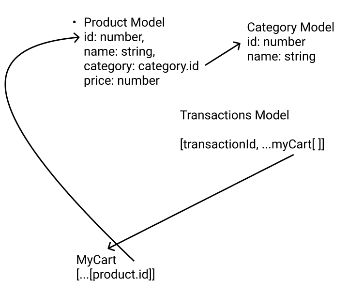

# Simple Point of Sales App
a small prototype to present the functionality of Point of sales app

## what this app do
- add or edit products to the database/state
- add or edit categories
- add or remove products to the user cart
- billing history that record all the previous transactions

## [Storage](/src/storage.tsx)
a state that stores global data to be used through the entire app.
use useStorage hook to access the data
```
import {useStorage} from 'storage'

const App = () => {
    storage = useStorage()
    console.log(storage.myCart)
    ...
}

```


## How to use

```
yarn/npm install
yarn/npm dev
```


## SITE 
[point-of-sales.vercel](https://point-of-sales-puce.vercel.app/)


## Raw Design
[figma](https://www.figma.com/file/YosXeoeM3NjaRRG9qTcZwz/small_pos_app)

## Schema

